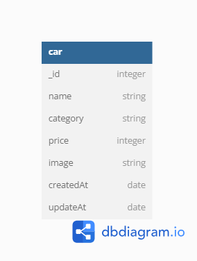

# Car management dashboard

Adalah aplikasi untuk manajemen data mobil.

## Database Diagram

aplikasi ini menggunakan modul sequelize yang
digunakan untuk mengurus koneksi ke
database.
berikut databasenya:

#### API

port= localhost:8000

**View**

- `/cars`(GET) = halaman menampilkan semua data car
- `/cars/create` (GET) = ini halaman untuk create new car
- `/cars/edit/:id` (GET) = ini halaman untuk edit car

**Action API**

- `/cars/admin/create` (POST) = ini API action untuk create new car
- `/cars/admin/edit/:id` (POST) = ini API action untuk update car
- `/cars/admin/delete/:id` (POST) = ini API action untuk delete car
